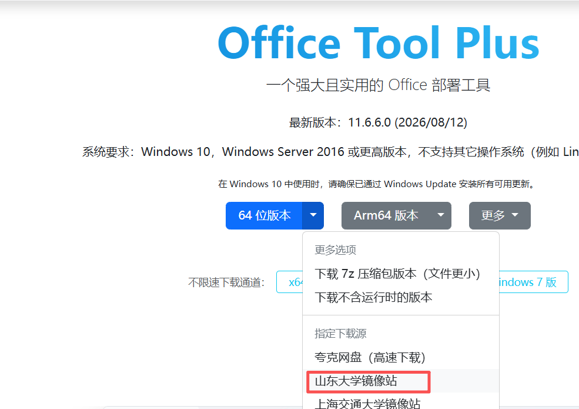
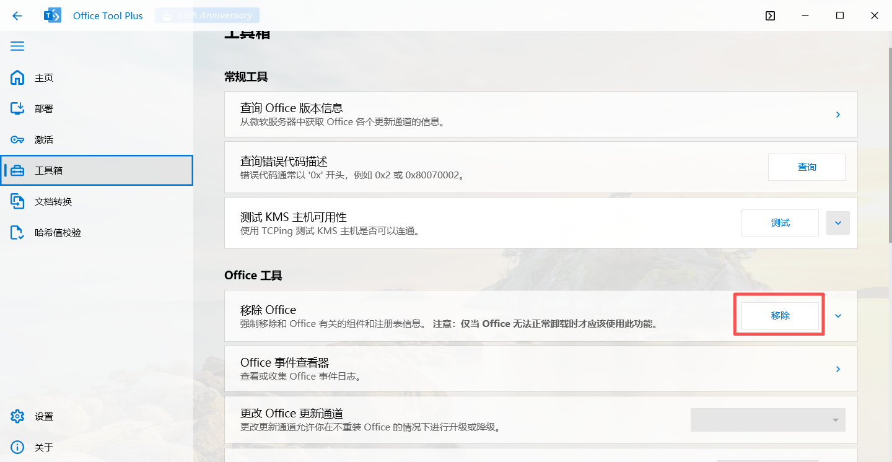
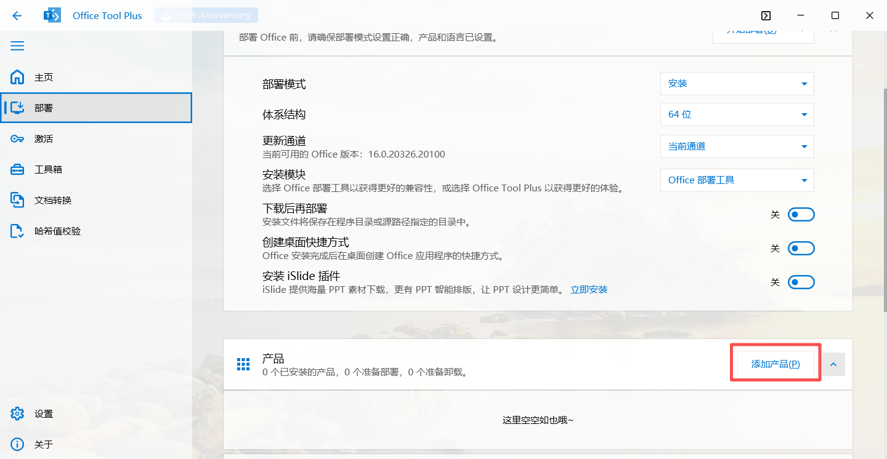
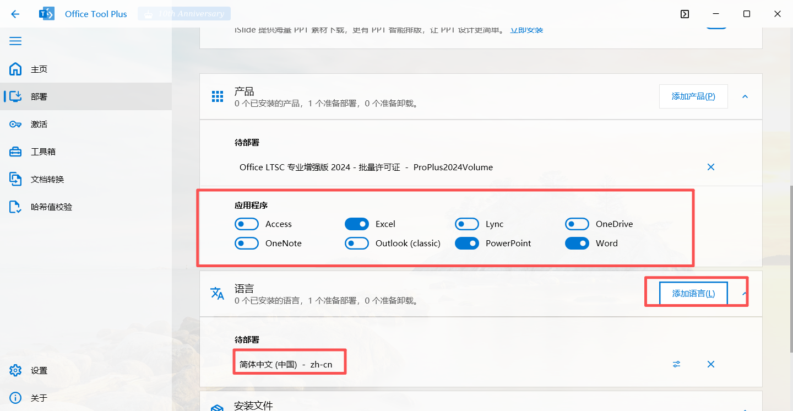
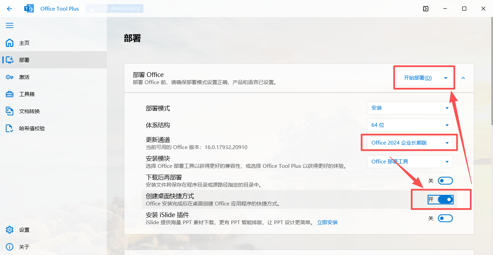
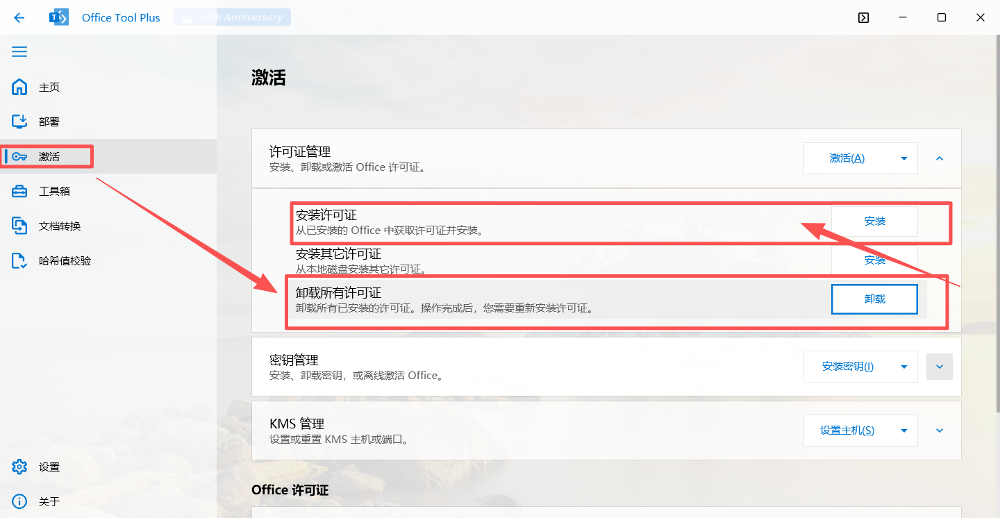
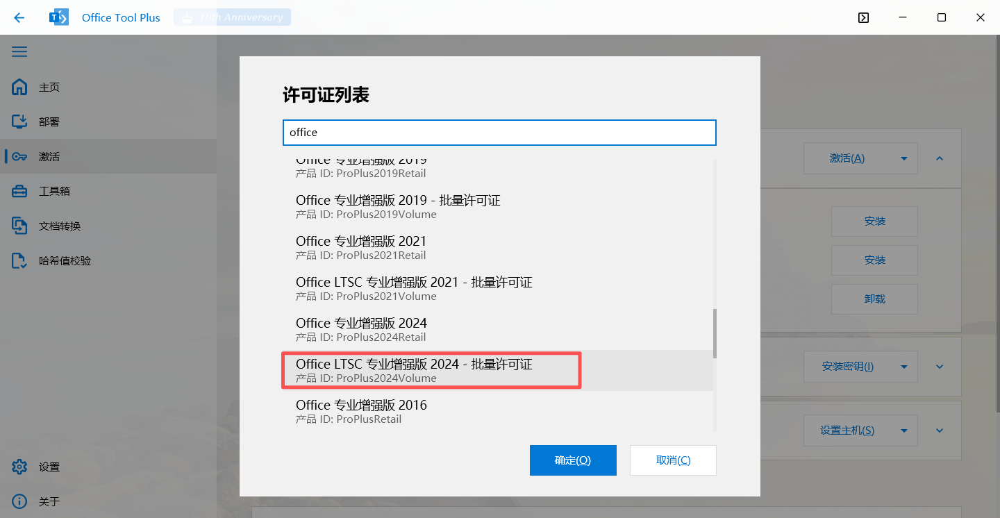
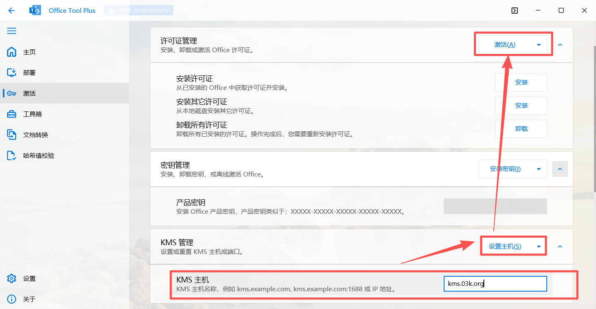

# 1.首先下载Office Tool

Office Tool下载地址：[点击这里](https://otp.landian.vip/zh-cn/download.html)

下载时使用镜像下载更快哦，可选择山东大学镜像站等

# 2.移除旧版office

# 3.部署（安装）Office

这里以Office LTSC专业增强版 2024批量许可证  部署Excel，PPT，Word，简体中文

# 4.移除旧/残留许可证并安装该版本许可证

之后刷新许可证之后__设置KMS主机__点击激活

# 5.B站教程视频

<iframe width="100%" height="468" src="//player.bilibili.com/player.html?isOutside=true&aid=116083486889285&bvid=BV11mZ5BfEBP&cid=36115122451&p=1" scrolling="no" border="0" frameborder="no" framespacing="0" allowfullscreen="true"></iframe>

